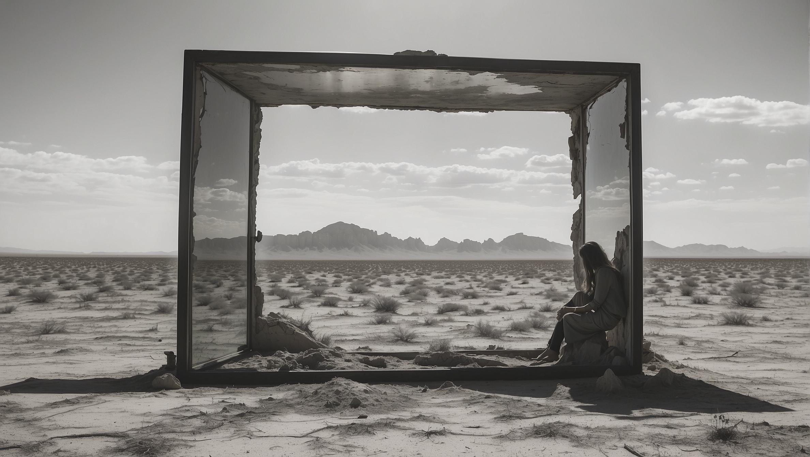

# EchoAI: A Journey into Visual Storytelling

## Table of Contents
- [The First Glimpse of EchoAI](#the-first-glimpse-of-echoai)
- [Personal Annotations](#personal-annotations)
- [The Art of EchoAI](#the-art-of-echoai)
- [Start: Installation Guide](#start-installation-guide)
- [Producing the First Echo](#producing-the-first-echo)
- [Mode 1 Exploration - The EchoAI Matrix](#mode-1-exploration---the-echoai-matrix)
- [Mode 2 Exploration - Refining](#mode-2-exploration---refining)
- [Mode 3 Operation - Visual Conversations](#mode-3-operation---visual-conversations)
- [Mode 4 Operation - Immersion](#mode-4-operation---immersion)
- [Gathering of Minds - EchoAI Collective](#gathering-of-minds---echoai-collective)
- [About the Author](#about-the-author)
- [EchoAI sample created with the Default Codex](#echoai-sample-created-with-the-default-codex)

---
## The First Glimpse of EchoAI

In the quiet hours of a night, accompanied only by the soft hum of my computer, a vision began to unfold in my mind—**the vision of EchoAI.** This vision was not just a fleeting thought, but a vivid, living idea. EchoAI, I imagined, would be a silent observer, a passive yet powerful presence in the room, listening intently to the ebb and flow of human conversation.

The idea was both simple and intriguing: **EchoAI would capture the essence of our dialogues,** the unspoken nuances, and the vibrant ideas being woven into the flow of our conversations. 

It would absorb the spoken words, the undercurrents of ideas in real-time, and transform these verbal threads into evolving visual narratives. These images would be more than static pictures; **they would be dynamic reflections of our collective thoughts,** like snapshots capturing the essence of our discussion.

I imagined this tool as an **enhancer of brainstorming sessions,** not interrupting but enriching the process, creating a shared visual dialogue that connected our ideas and minds. It was an ambitious goal, and to embark on this journey, I sought an unconventional path. 

I turned to ChatGPT, a digital companion, to help translate my vision into reality. And so, I turned to an ally, a guide in this unknown territory - ChatGPT. I communicated in English, **and ChatGPT replied with lines of Python,** a language unfamiliar to me, yet fascinatingly expressive.

In this collaboration, **EchoAI began to take shape** – not merely as a project, but as a manifestation of an idea, a bridge between human creativity and AI's boundless potential.

And as I sat there, witnessing the first lines of code come to life, **I sensed the dawn of a journey into uncharted realms of possibility.**

---
## Personal Annotations

The EchoAI of now, residing within the realm of code and logic, stands as a mere precursor to the vision I hold.

Its potential integration with collaborative web platforms, its seamless melding into the flow of live streams, Slack huddles, and Teams meetings, where it captures the essence of digital dialogues – these initial steps are but the groundwork for a more ambitious creation: **The EchoAI Room.**

This ultimate aspiration of mine is envisioned as a temple of creativity, a space yet to be realized. In this sacred chamber, ideas would not just be articulated but would come to vibrant life on **surrounding video walls,** forming a visual symphony in harmony with our conversations.

> EchoAI becomes a channel for unrestrained creative expression, a means to democratize the collective artistic journey.

As the brainstorming session concludes, it leaves behind not just memories, but a tangible, visual embodiment of a world born from creative collaboration, ready to be harnessed and explored.

---
## The Art of EchoAI

At its core, EchoAI is an exploration of the synergy between language and visuals, where each functionality opens a new realm of creative possibilities.

### Part 1: Crafting the Visual Codex
EchoAI's first step is the creation of a visual 'Codex', a dynamic and evolving library of artistic styles and elements. This process involves generating a massive amount of images, each showcasing a unique blend of visual traits a creator wishes to explore. These traits are instrumental in locking in a reusable and shareable visual 'codex', a foundational element of the EchoAI experience.

### Part 2: Conversational Visual Synthesis
In its second key function, EchoAI tunes into the rhythm of conversation, absorbing its nuances to create cohesive visuals that adhere to the chosen style of your Codex. This process is more than mere image generation; it's about weaving a visual story that parallels the conversation, turning each dialogue into an integral part of a broader creative universe birthed from your brainstorming sessions.

---
## Start: Installation Guide

As I chronicle these logs, not all warrant detailed documentation, but this one, the Activation Guide, is pivotal. It's a gateway for others to join this journey, to explore and contribute to the evolving world of EchoAI.

**Prerequisite Check:** 
- #### Ensure you have installed [Python version 3.11](https://www.python.org/downloads/) or above.
- #### Install the [latest version of Git](https://git-scm.com/downloads) to be able to clone and download EchoAI.
- #### Get your [OpenAI API Key](https://help.openai.com/en/articles/4936850-where-do-i-find-my-api-key) from your [user settings](https://platform.openai.com/account/api-keys).
- #### Get your [Leonardi.ai API Key](https://docs.leonardo.ai/docs/create-your-api-key).
- ###### (More API Support to follow soon)

### The macOS Installation
- #### Create a folder named EchoAI on your desktop.
- #### Open your terminal found in the Applications / Utilities folder.
- #### Type `cd` and drag the folder into the terminal window where you want to install EchoAI (then hit Enter).
- #### Type `git clone https://github.com/Anashel-RPG/echoai.git` and hit Enter.

### Windows Installation
- #### Create a folder named EchoAI on your desktop.
- #### Open your terminal found in the Applications / Utilities folder.
- #### Type `cd` and drag the folder into the terminal window where you want to install EchoAI (then hit Enter).
- #### Type `git clone https://github.com/Anashel-RPG/echoai.git` and hit Enter.

### API Key Configuration
- #### In your EchoAI folder, open the file [config.py](config.py) in your favorite text editor.
- #### Scroll down to the end of the file and replace `[Insert API KEY]` with your API key.
- #### Keep the `' '` characters, but replace `[]` with your API key.
- #### Do the same for your Leonardo.ai API Key. Make sure to keep the 'Bearer' string at the beginning.

> _Example:_ 

---
## Producing the First Echo

The default setting of EchoAI will produce around 12 images and should take 5 to 10 minutes on the first execution as it sets up a download of its Python dependencies. Be patient!

The first run will consume about 261 API credits.
- #### On macOS, type `sudo su` in your terminal, hit enter, and authenticate with your password. Drag the file [start_mac.sh](start_mac.sh) into your terminal window and hit enter.
- #### On Windows, double-click the file [start_windows.bat](start_windows.bat).

Your EchoAI images will be automatically saved in the local folder **"downloaded_images"**. Each echo image should be 2376 x 1344 pixels in landscape format.
> _The log will display this when a new image is added to your "downloaded_images" folder:_ 

The default Echo codex will vary in quality. Customizing its matrix will help you find a style you like.

If you want to run another cycle of echo, press the 'up arrow' key in your terminal and hit enter.
> _Example of echo results with the default codex:_ 

> 

---
## Mode 1 Exploration - The EchoAI Matrix

Building your own codex is a creative process, and the EchoAI Matrix is a tool to help achieve this. In the **'config-files/'** folder of your **EchoAI project**, you will find two important files; scene.csv and structure.csv.

**Scene.csv** is a list of scenes that will be used to generate your echo. You can change the default scene or add as many scenes as you want.
> **WARNING:**  Since this is a csv format, do not include any commas in your scene name, and try to avoid punctuation. Do not change the first row of your file; it should be named 'Scene Description' as it is case-sensitive.

Your second file, **Structure.csv,** represents a matrix of attributes that will be used to create your scenes. A matrix is composed of eight categories of attributes. By default, you will have nine values per category. These will be randomly combined with your scenes to explore different visual possibilities. A codex with the default matrix will hold 387 million possibilities.
> **WARNING:**  Similar to Scene.csv, you must not alter the first row and should not include any commas or punctuation when replacing or adding new attributes. You cannot change the number of categories or alter their names.
> 
>While you can add as many new attributes as you like, you must keep the same number of attributes per category.

To fully explore the possibilities of your codex, you should increase your EchoAI's multithreading capacity. This will be done in two locations. The first one is in your [config.py](config.py) file. Find the line `MAX_CONCURRENT_JOBS = 1` and change its value to 3. Note that 5 is the maximum value, but it may be less stable. This value manages how many echo images are being generated at the same time. Each echo will still have its own unique attributes combination.

The second location is in your [leonardo.json](config-files%2Fleonardo.json) file, located in your **'config-files/'** folder. Find the line `"NUM_IMAGES": 1`, and set its value to 2. This value manages how many variations (seeds) each echo should have. With the value 2, each unique echo attributes combination will always return two alternative image results. The maximum value is 4.

Finally, the last step is to define how many echo cycles you wish to run. A cycle is the full production of all your scenes. By default, the value is set to 1. You can change this value in your [config.py](config.py) file. Find the line `NUM_ITERATIONS = 1` and change the value to the number of cycles you wish to run. There is no max value.

> **Performance**
> - **A Codex of 12 scenes** | scene.csv
> - **With 9 attributes per category** | structure.csv
> - **Set for 2 cycles** | NUM_ITERATIONS = 2
> - **With 3 concurrent echoes** | MAX_CONCURRENT_JOBS = 3
> - **And 2 variations per echo** | "NUM_IMAGES": 2
>  
> Will generate around 35 images of **2376 × 1344** pixels in about 5 minutes, or the equivalent of 1 HD image every 8 seconds. Since they are batched and multi-threaded, they will show in batch updates in your downloaded_images folder.

> **Demo output** of the default codex on a 12.9.2.3.2 setting in 5 minutes. (Thumbnail) 

---
## Mode 2 Exploration - Refining

Your codex may be too limited in scenes and attributes to provide a creative exploration, or too vast to easily find a style you like. The EchoAI Refining mode is a tool to help you find the right balance.

Place all the images you like in the **ranking_good/** folder and all the images you don't like in the **ranking_bad/** folder. On macOS, open your terminal window and drag the **ranking_mac.sh** file into it. On Windows, double-click the **ranking_windows.bat** file.

Depending on the number of images you have, it may take up to 60 seconds to process. The result will show how often your attributes were present in the images you liked and how often certain attributes were involved in the images you did not like. With a small sample, you will see overlap between your good and bad attributes.

> 

Use this process to replace attributes you do not like or to reduce the number of attributes (while keeping the same number of attributes per category).

### Locking Your Style
After enough exploration, you may find the exact style you like. It is up to you whether you wish to use your codex or lock your style before going into conversation mode. If you want to lock a specific style, the steps are very simple.

The echo attributes, as well as the style, are saved in the file properties. Depending on your OS, the data may be truncated when trying to read it via the file properties. Search online for an [exif viewer online website](https://jimpl.com/) and upload your image. If the comments section shows "undefined", you may want to try a different viewer.

**In a text editor:**
1. Copy the ImageDescription Echo attributes value.
2. Copy the presetStyle value from the UserComment section.
3. Do not include the trailing semicolon.

**In your [config.py](config.py) file:**
1. Go to the **OVERRIDE SETTINGS** section.
2. To uncomment a line, remove the `#` character and its space at the beginning of the line.
3. Uncomment the **OVERRIDE_STYLE**.
4. Set its value to the **presetStyle** value you copied.
5. Uncomment the **OVERRIDE_STRING** and set its value to your echo attributes.
6. The echo attribute had your scene description; replace the scene part with `<SCENE>`.
7. Uncomment one **OVERRIDE_MODEL** based on your preference (Realistic versus Artistic).

You are now ready to run your codex through another cycle.

> Your configuration file with an **OVERRIDE** setting should look like this:
> 
 
> EXIF used as an override style setting
> 

> Demo output of an override codex on a 12.9.2.3.2 setting.
> 

---
## Mode 3 Operation - Visual Conversations

Now that you have your codex fine-tuned (either in open mode or override mode), it is time to explore the creative universe within your brainstorming meetings. Currently, EchoAI only supports text transcripts, but I hope to soon ship an audio input that can run in real-time during your brainstorming or creative conversations.

EchoAI ships with H.P. Lovecraft's 'Through the Gates of the Silver Key' as a demo transcript. Go to `config-files/conversation-capture.txt` to load your own transcript using a text editor. You must have a minimum of 20 sentences in your transcript.

> Running your codex on a conversation transcript is very simple.
> - Open your **config.py** file in a text editor.
> - Look for `USE_TRIGGER_FILE = False` and change it to `True`.
> - Warning: `True` and `False` in Python are **case-sensitive**.
> 
> You then **must set your main theme** that best describes the universe of your brainstorm. The value should be one sentence with no punctuation, and it is advised to start it with 'in the...'
> - `config.py / UNIVERSE = "in the dark world of lovecraft"`
> 
> Conversation mode does not support multi-threading (yet). We recommend using the following settings for your first conversation run:
> - `config.py / NUM_ITERATIONS = 1`
> - `config.py / MAX_CONCURRENT_JOBS = 1`
> - `leonardo.json / "NUM_IMAGES": 1`

 **EchoAI** will run your conversation in a two-pass filter. 

It will first take 5 successive sentences from a random location in your transcript. The following is a **demo output** of an override codex in conversation mode using H.P. Lovecraft's '**Through the Gates of the Silver Key**'.

### Echo Conversation Example #1
> **1. TRANSCRIPT EXCERPT**
> 
> After an impressive pause, the waves continued, saying that what the denizens of few-dimensioned zones call change is merely a function of their consciousness, which views the external world from various cosmic angles. As the shapes produced by the cutting of a cone seem to vary with the angles of cutting—being circle, ellipse, parabola, or hyperbola according to that angle, yet without any change in the cone itself—so do the local aspects of an unchanged and endless reality seem to change with the cosmic angle of regarding. To this variety of angles of consciousness, the feeble beings of the inner worlds are slaves, since with rare exceptions they cannot learn to control them. Only a few students of forbidden things have gained inklings of this control, and have thereby conquered time and change.
>
> **2. FIRST PASS OUTPUT**
> 
> This text speaks of the idea that what is seen as change in our limited world is merely a function of viewing the infinite reality from different angles. One can learn to control these angles, although this knowledge is rare and usually forbidden.
>
> **3. SECOND PASS OUTPUT**
> 
> Mystical hooded figure with forbidden knowledge, iridescent gemstones embedded in sleeves, in the dark world of Lovecraft.
>
> **4. ECHO IMAGE RESULT**
> 
> 

### Echo Conversation Example #2
> **1. TRANSCRIPT EXCERPT**
> 
> It was as if he floated in a torrid, rose-tinctured sea; a sea of drugged wine whose waves broke foaming against shores of brazen fire. A great fear clutched him as he half saw that vast expanse of surging sea lapping against its far-off coast. But the moment of silence was broken—the surgings were speaking to him in a language that was not of physical sound or articulate words. “The man of Truth is beyond good and evil,” intoned a voice that was not a voice.
>
> **2. FIRST PASS OUTPUT**
> 
> The text described a surreal scene of an unknown, rosy sea with waves of drugged wine breaking against shores of fire. A voice not heard with mortal ears spoke of a man who has travelled beyond the realms of good and evil.
>
> **3. SECOND PASS OUTPUT**
> 
> Raging seas of fiery wine cascading on golden shores in the dark world of Lovecraft.
>
> **4. ECHO IMAGE RESULT**
> 
> 

###   Refining First and Second Passes
If you wish to control the behavior of the first and second passes, open the **trigger.py** file in a text editor and look for the **FIRST PASS SETTINGS** and **SECOND PASS SETTINGS** section. The prompt tag represents the instructions given to ChatGPT to transform our original text into a scene that will be rendered in our Echo pipeline (using our attributes or override setting).

---
## Mode 4 Operation - Immersion

Running EchoAI in Immersion mode is a way to display real-time fullscreen versions of echo images as they arrive. If you want to broadcast your Echo on a stream, on a monitor, or as a webcam feed, you can capture the feed using OBS / Streamlabs OBS and set it as a Virtual Webcam (for Slack Huddle, Microsoft Teams Meeting, or Google Hangout), set it as a Twitch stream, or as a YouTube livestream.
> Immersion mode can only be run using a single-thread setting with one image per thread. You can change these settings with your text editor.
> - `config.py / MAX_CONCURRENT_JOBS = 1`
> - `leonardo.json / "NUM_IMAGES": 1`
>
> Once you have set the required settings, you can activate Immersion mode in the `config.py` file.
> - Look for `SLIDESHOW_ENABLED = False` and change it to `True`.
> - Warning: `True` and `False` in Python are **case-sensitive**.

---
## Gathering of Minds - EchoAI Collective

EchoAI was the result of a weekend jam session with ChatGPT, driven by a personal need for greater exploration possibilities in a passive experience. API cost will probably limit access to a larger audience. I hope to add more API bridges outside [Leonardo.ai](https://leonardo.ai/), including [SDNEXT](https://github.com/vladmandic/automatic) to enable your own GPU usage.

If you run an AI image generation service with API capacity and would like to collaborate, please reach out to me on [Discord](https://discord.gg/arg) user Anashel or on [LinkedIn](https://www.linkedin.com/in/adoyon/). I plan to explore if integration with [Mage.space](https://www.mage.space/) and [Civitai.com](https://civitai.com/) API services would be possible.

In the meantime, I invite you to share your own EchoAI codex (scene.csv and structure.csv) or your Override settings with the community, along with the creative results of your work!

---
## About the Author

My AI journey started a little over a year ago on the [r/StableDiffusion](https://www.reddit.com/r/StableDiffusion/) subreddit with a mind-blowing community of creators, artists, programmers, and hobbyists. It had the vibe of the early 80's - 90's BBS community, where every week we were mind-blown by something new, or something someone managed to connect overnight.

I got the motivation to train the official [RPG model checkpoint](https://civitai.com/models/1116/rpg), now at version 5.0. I also wrote a [41-page guide](https://civitai.com/models/115223?modelVersionId=124633) on prompting and contributed over [90 RPG ControlNet](https://civitai.com/models/97181?modelVersionId=144429) depth maps. You can support me via my [Patreon page](https://www.patreon.com/RPGAI). For any business opportunities, crazy ideas, or just for chatting, the fastest way to reach me is on my Discord server / user Anashel.

---
## EchoAI sample created with the Default Codex

